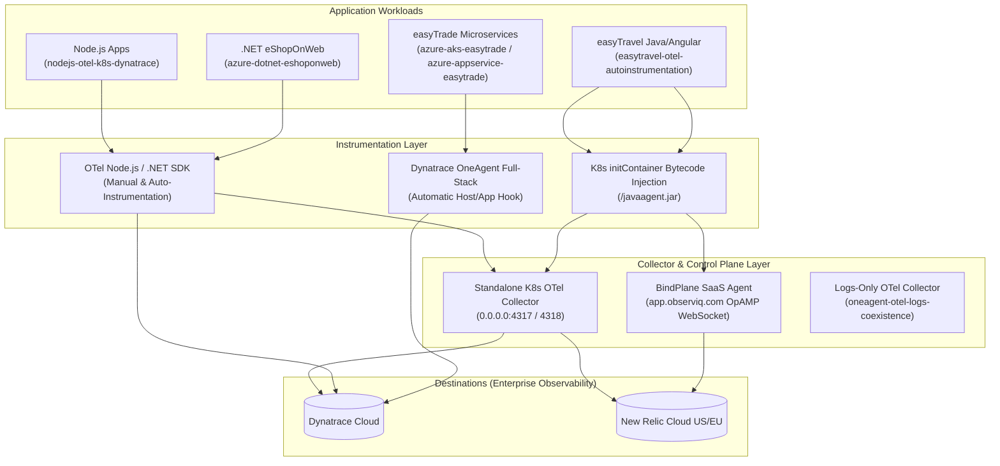

# Enterprise OpenTelemetry Observability Laboratory (`otel-lab`)

[](https://opentelemetry.io)
[](https://kubernetes.io)
[](https://dynatrace.com)
[](https://observiq.com)

Welcome to the **`otel-lab` Enterprise OpenTelemetry Observability Laboratory**. This repository serves as a comprehensive reference architecture and hands-on laboratory for instrumenting, enriching, and shipping telemetry across cloud-native microservices and legacy enterprise workloads.

---

## 🏗️ Repository Architecture & Standardized Directory Index

All generic lab names (`lab1`, `lab2`, etc.) have been standardized to self-describing directory names that clearly communicate their platform, workload, and telemetry architecture:

| Standardized Folder Name | Legacy Name | Platform | Target Application Workload | Architectural Pattern | Comprehensive Documentation |
| :--- | :--- | :--- | :--- | :--- | :--- |
| **`nodejs-otel-k8s-dynatrace/`** | `lab1/` | Kubernetes | Node.js Express (`my-otel-app`) | **SDK Manual Instrumentation** + standalone K8s OTel Collector enriching Kubernetes metadata and exporting to Dynatrace. | [NodeJS_OTel_K8s_Dynatrace_README.md](file:///f:/otel-lab/otel-lab_Documentation/NodeJS_OTel_K8s_Dynatrace_README.md) |
| **`oneagent-otel-logs-coexistence/`** | `lab2/` | Linux VM | Node.js Demo Service | **Enterprise Coexistence** where Dynatrace OneAgent handles full-stack traces/metrics automatically while an OTel Collector ships logs. | [OneAgent_OTel_Logs_Coexistence_README.md](file:///f:/otel-lab/otel-lab_Documentation/OneAgent_OTel_Logs_Coexistence_README.md) |
| **`easytravel-otel-autoinstrumentation/`** | `lab3/` | Kubernetes | Dynatrace `easyTravel` | **Zero-Operator Auto-Instrumentation** via Kubernetes `initContainers` (`/javaagent.jar`) + standalone OTel Collector. | [Easytravel_OTel_AutoInstrumentation_README.md](file:///f:/otel-lab/otel-lab_Documentation/Easytravel_OTel_AutoInstrumentation_README.md) |
| **`easytravel-bindplane-saas/`** | `BindPlane-Lab/` | Kubernetes | Dynatrace `easyTravel` | **SaaS Control Plane** where OTLP telemetry is routed to an observIQ **BindPlane SaaS Agent** managed from the browser. | [Easytravel_BindPlane_SaaS_README.md](file:///f:/otel-lab/otel-lab_Documentation/Easytravel_BindPlane_SaaS_README.md) |
| **`azure-dotnet-eshoponweb/`** | `Azuredotnet/` | Azure Cloud | Microsoft `eShopOnWeb` | ASP.NET Core e-commerce reference application instrumented with OpenTelemetry .NET SDK and Windows IIS instrumentation. | [Azure_DotNet_eShopOnWeb_README.md](file:///f:/otel-lab/otel-lab_Documentation/Azure_DotNet_eShopOnWeb_README.md) |
| **`azure-java-demoapp/`** | `azureappjava/` | Azure Cloud | Java Spring Boot App | Java Spring Boot microservice with OpenTelemetry Java Agent (`-javaagent`) deployed to Azure PaaS. | [Azure_Java_DemoApp_README.md](file:///f:/otel-lab/otel-lab_Documentation/Azure_Java_DemoApp_README.md) |
| **`azure-aks-easytrade/`** | `AzureAKS/` | Azure AKS | Dynatrace `easytrade` | Cloud-native multi-tier financial trading application deployed on Azure Kubernetes Service (AKS). | [Azure_AKS_EasyTrade_README.md](file:///f:/otel-lab/otel-lab_Documentation/Azure_AKS_EasyTrade_README.md) |
| **`azure-appservice-easytrade/`** | `AzureApp/` | Azure App Service | Dynatrace `easytrade` | Containerized PaaS deployment of `easytrade` on Azure App Service Linux. | [Azure_AppService_EasyTrade_README.md](file:///f:/otel-lab/otel-lab_Documentation/Azure_AppService_EasyTrade_README.md) |
| **`azure-aks-logs/`** | `AKS_log/` | Azure AKS | Container Log Pipelines | Designated directory for container log ingestion, FluentBit, and OpenTelemetry log pipeline templates. | [Azure_AKS_Logs_README.md](file:///f:/otel-lab/otel-lab_Documentation/Azure_AKS_Logs_README.md) |

---

## 🌐 Global Observability Architecture



---

## 🔑 Key Architectural Principles Demonstrated

### 1. Zero-Flake Kubernetes Auto-Instrumentation (`initContainers`)
In resource-constrained environments (such as KillerCoda playgrounds or edge AKS clusters), Kubernetes mutating admission webhooks (`cert-manager` or `opentelemetry-operator`) can cause CNI timeouts (`connect: no route to host`). This repository demonstrates production-ready **zero-operator/zero-webhook auto-instrumentation** using standard Kubernetes `initContainers` that mount the OpenTelemetry Java Agent (`/javaagent.jar`) via an `emptyDir` shared volume.

### 2. Network Binding Best Practices (`0.0.0.0`)
All OpenTelemetry Collector and BindPlane Agent Kubernetes services configure their OTLP gRPC/HTTP receivers to listen on **`0.0.0.0:4317`** and **`0.0.0.0:4318`**. Binding to all interfaces (rather than loopback `127.0.0.1`) ensures reliable cross-pod and cross-namespace OTLP communication.

### 3. Vendor Coexistence (Dynatrace OneAgent + OpenTelemetry)
In enterprise environments, organizations do not need to choose exclusively between proprietary vendor agents and OpenTelemetry. As demonstrated in `oneagent-otel-logs-coexistence/`, teams can deploy **Dynatrace OneAgent** for automated full-stack trace/metric capture while running an **OpenTelemetry Collector** alongside to tail, enrich, and ship custom logs.

---

## 📚 Central Documentation (`otel-lab_Documentation/`)

All detailed technical documentation, walkthroughs, and architecture diagrams are maintained in the central [otel-lab_Documentation/](file:///f:/otel-lab/otel-lab_Documentation) directory:
- [OTel_Lab_Global_Overview.md](file:///f:/otel-lab/otel-lab_Documentation/OTel_Lab_Global_Overview.md) – Enterprise architectural overview and repository design principles.
- [NodeJS_OTel_K8s_Dynatrace_README.md](file:///f:/otel-lab/otel-lab_Documentation/NodeJS_OTel_K8s_Dynatrace_README.md) – Node.js OpenTelemetry Kubernetes to Dynatrace guide.
- [OneAgent_OTel_Logs_Coexistence_README.md](file:///f:/otel-lab/otel-lab_Documentation/OneAgent_OTel_Logs_Coexistence_README.md) – OneAgent & OpenTelemetry logs coexistence architecture.
- [Easytravel_OTel_AutoInstrumentation_README.md](file:///f:/otel-lab/otel-lab_Documentation/Easytravel_OTel_AutoInstrumentation_README.md) – easyTravel Kubernetes zero-operator auto-instrumentation.
- [Easytravel_BindPlane_SaaS_README.md](file:///f:/otel-lab/otel-lab_Documentation/Easytravel_BindPlane_SaaS_README.md) – observIQ BindPlane SaaS integration lab.
- [Azure_DotNet_eShopOnWeb_README.md](file:///f:/otel-lab/otel-lab_Documentation/Azure_DotNet_eShopOnWeb_README.md) – .NET eShopOnWeb OpenTelemetry on Azure.
- [Azure_Java_DemoApp_README.md](file:///f:/otel-lab/otel-lab_Documentation/Azure_Java_DemoApp_README.md) – Azure Java demo application telemetry guide.
- [Azure_AKS_EasyTrade_README.md](file:///f:/otel-lab/otel-lab_Documentation/Azure_AKS_EasyTrade_README.md) – Dynatrace easyTrade on Azure AKS.
- [Azure_AppService_EasyTrade_README.md](file:///f:/otel-lab/otel-lab_Documentation/Azure_AppService_EasyTrade_README.md) – Dynatrace easyTrade on Azure App Service.
- [Azure_AKS_Logs_README.md](file:///f:/otel-lab/otel-lab_Documentation/Azure_AKS_Logs_README.md) – AKS log collection pipeline documentation.

---

## 🚀 Quick Start

1. **Clone the Repository:**
   ```bash
   git clone https://github.com/yuvrajjohrawanshi/otel-lab.git
   cd otel-lab
   ```
2. **Navigate to your target lab folder** using the table above (e.g., `cd easytravel-otel-autoinstrumentation`).
3. **Run the deployment script** or inspect the manifests as outlined in the respective README inside `otel-lab_Documentation/`.
