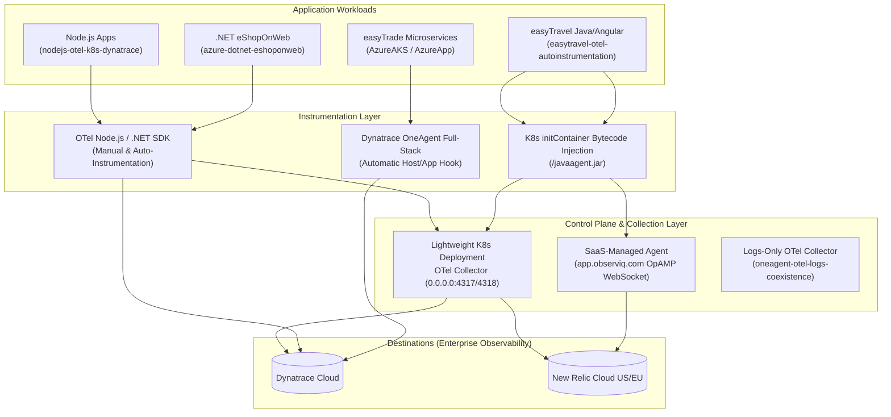

# [[OTel_Lab_Global_Overview]]: OpenTelemetry Enterprise Architecture & Labs Repository

## Executive Summary
This repository is an enterprise observability laboratory demonstrating how to architect, instrument, and deploy cloud-native and legacy applications using **[[OpenTelemetry]]** across **Kubernetes (KillerCoda / Azure AKS)**, **Linux Virtual Machines**, and **Azure App Service (PaaS)**. 

Every lab in this repository illustrates production-grade observability patterns—including OpenTelemetry SDK manual instrumentation, zero-code bytecode auto-instrumentation via Kubernetes `initContainers`, coexistence with **[[DynatraceOneAgent]]**, and SaaS-managed pipelines using **[[BindPlane]] SaaS**.

---

## Standardized Repository Directory Structure
To provide clear, self-describing architectural intent, all generic lab folder names (`lab1`, `lab2`, etc.) have been renamed to standardized descriptive names:

| Standardized Folder Name | Legacy Name | Target Platform | Workload / Application | Key Architecture & Documentation |
| :--- | :--- | :--- | :--- | :--- |
| **`nodejs-otel-k8s-dynatrace/`** | `lab1/` | Kubernetes | Node.js (`[[my-otel-app]]`) | OpenTelemetry SDK manual instrumentation + standalone K8s OTel Collector exporting to Dynatrace. See [[NodeJS_OTel_K8s_Dynatrace_README]]. |
| **`oneagent-otel-logs-coexistence/`** | `lab2/` | Linux VM | Node.js Demo Service | Real-world coexistence: Dynatrace OneAgent handles traces/metrics automatically while an OpenTelemetry Collector ships application logs. See [[OneAgent_OTel_Logs_Coexistence_README]]. |
| **`easytravel-otel-autoinstrumentation/`** | `lab3/` | Kubernetes | Dynatrace `[[easyTravel]]` | 100% reliable zero-operator/zero-webhook Java auto-instrumentation injected via `initContainers` + lightweight OTel Collector. See [[Easytravel_OTel_AutoInstrumentation_README]]. |
| **`easytravel-bindplane-saas/`** | `BindPlane-Lab/` | Kubernetes | Dynatrace `[[easyTravel]]` | Auto-instrumented application sending OTLP telemetry to an observIQ **[[BindPlane]] SaaS Agent** managed from the browser. See [[Easytravel_BindPlane_SaaS_README]]. |
| **`azure-dotnet-eshoponweb/`** | `Azuredotnet/` | Azure Cloud | Microsoft `[[eShopOnWeb]]` | ASP.NET Core e-commerce reference application instrumented with OpenTelemetry .NET SDK and IIS/Windows agents. See [[Azure_DotNet_eShopOnWeb_README]]. |
| **`azure-java-demoapp/`** | `azureappjava/` | Azure Cloud | Java Spring Boot App | Java Spring Boot microservice with OpenTelemetry Java Agent (`-javaagent`) deployed to Azure PaaS. See [[Azure_Java_DemoApp_README]]. |
| **`AzureAKS/`** | `AzureAKS/` | Azure AKS | Dynatrace `[[easytrade]]` | Cloud-native multi-tier trading application deployed on Azure Kubernetes Service (AKS). See [[Azure_AKS_EasyTrade_README]]. |
| **`AzureApp/`** | `AzureApp/` | Azure App Service | Dynatrace `[[easytrade]]` | Containerized PaaS deployment of `[[easytrade]]` on Azure App Service Linux. See [[Azure_AppService_EasyTrade_README]]. |
| **`AKS_log/`** | `AKS_log/` | Azure AKS | Log Collection Pipeline | Kubernetes container log ingestion and FluentBit / OpenTelemetry log pipeline templates. See [[Azure_AKS_Logs_README]]. |

---

## Core Enterprise Observability Patterns Demonstrated

---

## Architecture Principles Across the Repository

### 1. Zero-Flake Kubernetes Deployments
- **No Mutating Webhooks Required:** In resource-constrained environments (such as KillerCoda playgrounds or edge AKS clusters), mutating admission webhooks (`cert-manager` / `opentelemetry-operator`) often cause DNS or CNI timeouts (`no route to host`).
- **Reliable Auto-Instrumentation:** In `[[easytravel-otel-autoinstrumentation]]` and `[[easytravel-bindplane-saas]]`, Java agents are injected cleanly using standard Kubernetes `initContainers` that mount `/javaagent.jar` to an `emptyDir` shared volume without relying on webhooks or Operators.

### 2. Network Endpoint Best Practices (`0.0.0.0`)
- All standalone OpenTelemetry Collector and BindPlane Agent Kubernetes services bind their OTLP gRPC/HTTP receivers to **`0.0.0.0:4317`** and **`0.0.0.0:4318`**. This ensures the containers listen on all network interfaces rather than loopback (`127.0.0.1`), enabling seamless cross-pod and cross-namespace OTLP communication.

### 3. Coexistence of Vendor Agents and OpenTelemetry
- As shown in `[[oneagent-otel-logs-coexistence]]`, modern enterprises do not need to choose exclusively between vendor agents and OpenTelemetry. Organizations can deploy **Dynatrace OneAgent** for automatic full-stack trace/metric capture while deploying an **OpenTelemetry Collector** alongside to ship and enrich application logs.

---

## Documentation Index (`otel-lab_Documentation/`)
All technical specifications, deployment walkthroughs, and architecture diagrams are maintained centrally in the `otel-lab_Documentation/` directory in accordance with Obsidian WikiLink syntax:
- [[Easytravel_OTel_AutoInstrumentation_README]]: Documentation for `easytravel-otel-autoinstrumentation/`.
- [[Easytravel_BindPlane_SaaS_README]]: Documentation for `easytravel-bindplane-saas/`.
- [[NodeJS_OTel_K8s_Dynatrace_README]]: Documentation for `nodejs-otel-k8s-dynatrace/`.
- [[OneAgent_OTel_Logs_Coexistence_README]]: Documentation for `oneagent-otel-logs-coexistence/`.
- [[Azure_AKS_EasyTrade_README]]: Documentation for `AzureAKS/`.
- [[Azure_AppService_EasyTrade_README]]: Documentation for `AzureApp/`.
- [[Azure_DotNet_eShopOnWeb_README]]: Documentation for `azure-dotnet-eshoponweb/`.
- [[Azure_Java_DemoApp_README]]: Documentation for `azure-java-demoapp/`.
- [[Azure_AKS_Logs_README]]: Documentation for `AKS_log/`.
- [[BindPlane_Integration]]: Enterprise architecture whitepaper on observIQ BindPlane SaaS integration.
