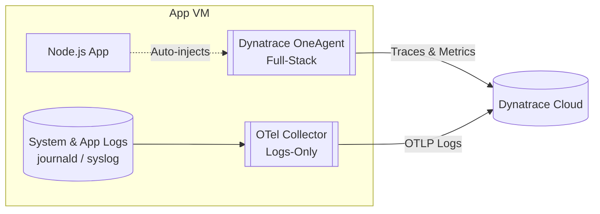

# [[oneagent-otel-logs-coexistence]]: Dynatrace OneAgent & OpenTelemetry Logs Coexistence

## Overview
The `oneagent-otel-logs-coexistence/` folder (formerly `lab2`) demonstrates an enterprise coexistence architecture on Linux VMs where **[[DynatraceOneAgent]] (Full-Stack)** handles traces and metrics automatically without touching application code, while an **[[OpenTelemetryCollector]] (Logs-Only)** collects and ships custom application and system logs (`journald` / syslog).

## Architecture & Data Flow

1. **[[DynatraceOneAgent]]:** Automatically hooks into the JVM/Node runtime to provide distributed tracing, profiling, and infrastructure metrics with zero manual instrumentation.
2. **[[OpenTelemetryCollector]] (Logs-Only):** Configured via `/etc/otel-collector-config.yaml` to tail system logs and application log files, filtering and forwarding them to Dynatrace via OTLP/HTTP log ingest.

## Key Files & Directories
- [app/](file:///f:/otel-lab/oneagent-otel-logs-coexistence/app): Simple Node.js demo service generating sample log events.
- [collector/](file:///f:/otel-lab/oneagent-otel-logs-coexistence/collector): Collector configuration (`[[otel-collector.yaml]]`) and systemd unit (`[[otel-collector.service]]`).
- [terraform/](file:///f:/otel-lab/oneagent-otel-logs-coexistence/terraform): Infrastructure-as-Code (`[[main.tf]]`, `[[variables.tf]]`, `[[setup_app.sh]]`) to provision Linux VMs and automate coexistence setup.
